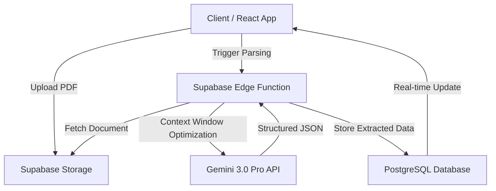

# DockParser (InvoiceFlow AI)

**DockParser** is an AI-Native document processing engine that leverages multimodal LLMs to transform unstructured PDF/Image data into strictly typed JSON schemas. Architected for high-velocity deployment using Supabase Edge Functions and Google Gemini 3.0 Pro.

---

## ⚡ Development Velocity Metrics (AI-Native Engineering)
This codebase is an example of **High-Velocity AI-Native Engineering**. By orchestrating agentic workflows, this architecture was produced at 10x the velocity of traditional manual coding.

* **Volume:** ~66.7M Tokens routed (OpenRouter telemetry)
* **Equivalent Effort:** ~4 Human Work Years compressed into a single development sprint.
* **Architecture:** Iterative design using automated refactoring loops and architectural stress-testing.

---

## 🏗 System Architecture

The following architecture was designed to minimize latency while maintaining type safety across the full stack.

